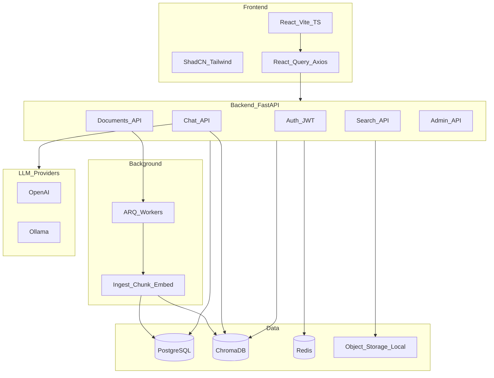
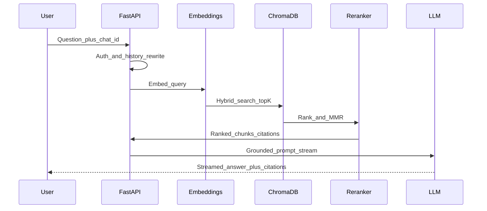

# Architecture

Knowledge Chatbot is a grounded RAG application: every answer must be supported by retrieved chunks from the user's (or organization's) knowledge base. Hallucination from general model knowledge is disabled by default.

## Goals

- Answer **only** from uploaded / ingested knowledge
- Hybrid tenancy: personal documents and optional shared organizations
- Pluggable LLM and embedding providers (OpenAI, Ollama; extendable)
- Clean Architecture on the backend; feature-based frontend
- Production concerns: auth, rate limits, auditing, workers, Docker

## High-level system



## Tenancy model

| Scope | Collection key | Access |
|-------|----------------|--------|
| Personal | `kb_{user_id}` | Owning user only |
| Organization | `kb_org_{org_id}` | Org members by role (`owner`, `admin`, `member`) |

Documents declare `scope` (`personal` or `organization`) and optional `organization_id`. Platform admins can manage users/storage via the Admin API; they do not automatically read private KBs unless granted.

## Backend layers

```
API routers  →  Services (use cases)  →  Repositories (SQLAlchemy)
                      ↓
              RAG / LLM / Embeddings / Workers
```

- **Routers** — HTTP, auth dependencies, status codes
- **Services** — business rules (upload, chat turn, search)
- **Repositories** — persistence
- **RAG** — chunking, hybrid retrieval, MMR / rerank, compression, prompts
- **LLM / Embeddings** — Protocol + factory (`openai`, `ollama`)
- **Workers (ARQ)** — async ingest: parse → OCR → chunk → embed → status

## RAG pipeline



### Grounding policy

1. Retrieve top-K with hybrid search (vector + keyword) and MMR.
2. Drop chunks below `RAG_SIMILARITY_THRESHOLD`.
3. If remaining context is insufficient, return exactly:

   `I could not find this information in the provided knowledge base.`

4. Otherwise stream an answer that cites document, page, chunk, and score.
5. `RAG_ALLOW_GENERAL_KNOWLEDGE=false` by default; when true (explicit setting), the model may use general knowledge **after** stating what came from the KB — this path is opt-in only.

### System prompt (canonical)

```
You are an AI assistant.
Answer ONLY using retrieved context.
Never fabricate information.
If information does not exist: say that you cannot find it.
Always cite sources.
Be concise but complete.
```

## Data model (PostgreSQL)

- `users`, `sessions` / refresh tokens, `password_reset_tokens`
- `organizations`, `organization_members`
- `documents`, `document_chunks`, `tags`, `document_tags`
- `chats`, `messages` (citations JSON on assistant messages)
- `settings` (LLM, embedding, RAG params, system prompt override)
- `audit_logs`, `analytics_events`

Vectors live in ChromaDB; PostgreSQL holds chunk metadata and FK links.

## Frontend structure

Feature modules under `frontend/src/features/`:

- `auth`, `dashboard`, `knowledge`, `chat`, `search`, `admin`, `settings`

Shared UI: ShadCN components, layout shell, document viewer.

## Security baseline

- JWT access + refresh; password hashing (argon2/bcrypt)
- Redis rate limiting
- Pydantic validation; MIME/extension allowlist; upload size caps
- Parameterized SQL; XSS-safe markdown; secrets via environment
- Prompt isolation: retrieved context wrapped in delimiters; refuse out-of-KB

## Extensibility

Future modules plug in without rewriting core:

| Module | Integration point |
|--------|-------------------|
| Voice / STT / TTS | `services/` + streaming media routes |
| Multimodal / image QA | OCR + vision LLM provider |
| Agentic tools | `rag/` tool registry |
| Web search | Optional retrieval source behind feature flag |
| Email / WhatsApp / Slack | Channel adapters calling Chat service |
| VS Code / Mobile | Same REST + SSE/WebSocket API |

## Phase map

1. Architecture & scaffold (this phase)
2. Backend foundation (models, DI, logging, health)
3. Frontend shell
4. Authentication
5. Knowledge ingestion
6. Embeddings & workers
7. Full RAG
8. Chat UI
9. Admin
10. Tests
11. Docker polish
12. Deployment docs & runbooks
